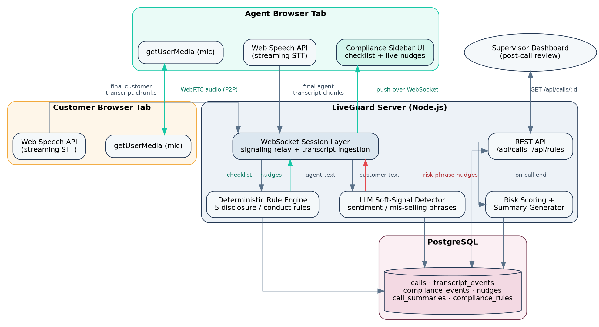

# LiveGuard — Real-Time Compliance & Risk Co-Pilot for BFSI Call Centers

LiveGuard listens to a live sales call (loan / insurance / credit card) and nudges the
agent **while the call is still happening** — instead of the industry-standard practice
of sampling and auditing recordings after the fact, by which point a mis-sale or a
missed regulatory disclosure has already occurred.



## What's actually in this repo

| Deliverable | Location |
|---|---|
| Source code | `server/` (backend), `web/` (frontend) |
| Working demo | run locally per [Quickstart](#quickstart) below |
| Architecture diagram | [`docs/architecture.png`](docs/architecture.png) / [`.svg`](docs/architecture.svg) |
| README | this file |
| API documentation | [`API_DOCUMENTATION.md`](API_DOCUMENTATION.md) |
| Database schema | [`db/schema.sql`](db/schema.sql) |
| Assumptions & limitations | [`ASSUMPTIONS.md`](ASSUMPTIONS.md) |
| AI tools used | [`AI_TOOLS_USED.md`](AI_TOOLS_USED.md) |
| Demo video script | [`DEMO_SCRIPT.md`](DEMO_SCRIPT.md) |
| Presentation | [`presentation/LiveGuard_Presentation.pptx`](presentation/LiveGuard_Presentation.pptx) |

## How it works, in one paragraph

Two browser tabs (agent + customer) place a real **WebRTC** audio call to each other.
Each tab runs the browser's **Web Speech API** on its own microphone and streams
finalized transcript chunks to a small Node.js server over a WebSocket. The server runs
the agent's cumulative speech through a **deterministic rule engine** (5 disclosure/
conduct rules, pattern-matched — explainable and auditable, no black box) and runs the
customer's speech through a narrow **LLM-assisted soft-signal detector** (affordability
stress, "guaranteed return" claims, confusion, cancellation intent). Both push live
**nudges** back to the agent's sidebar. When the call ends, a risk score and a
plain-English summary are generated and persisted to **PostgreSQL** for supervisor
review.

## Quickstart

### 1. Backend

```bash
cd server
cp .env.example .env        # edit DATABASE_URL if needed
npm install
npm run db:init              # loads db/schema.sql into Postgres (requires a running Postgres)
npm start
```

The server serves both the API/WebSocket **and** the static frontend at
`http://localhost:8080`.

> No Postgres handy? The server degrades gracefully: transcript/compliance/nudge
> persistence calls catch DB errors and log a warning, so the **live demo still works
> end-to-end in-memory** — only the post-call history/dashboard needs the database.

### 2. Try it

1. Open `http://localhost:8080/index.html` in **two tabs** (or two browser windows).
2. In tab 1, click **Join as Agent**. In tab 2, use the **same Call ID** shown in tab 1's
   header and click **Join as Customer**.
3. Allow microphone access in both tabs.
4. Talk. On the agent tab you'll see:
   - a live transcript,
   - the compliance checklist ticking off as required disclosures are said,
   - real-time nudges when a disclosure is overdue or the customer says something risky
     (try: *"I'm not sure I can afford this"* or *"is this guaranteed, no risk at all?"*).
5. Click **End Call** to generate the post-call summary + risk score.

Chrome or Edge is recommended — the Web Speech API isn't implemented in Firefox/Safari.

## Repo layout

```
liveguard/
├── db/schema.sql              # Postgres schema + seed compliance rules
├── server/                    # Node.js/Express backend
│   └── src/
│       ├── index.js           # HTTP + WS entrypoint
│       ├── ws.js              # call-session WebSocket server (signaling + engine)
│       ├── rulesEngine.js     # deterministic disclosure rules
│       ├── llmSignals.js      # LLM-assisted soft-signal detector
│       ├── summary.js         # risk scoring + post-call summary text
│       ├── db.js               # Postgres access layer
│       └── routes/calls.js    # REST endpoints
├── web/                       # static frontend (WebRTC + Web Speech API + UI)
├── docs/architecture.*        # architecture diagram sources + renders
└── presentation/               # pitch deck
```

## Scope

Five disclosure/conduct rules are implemented (not a full regulatory library), one
language (English), and no real telephony/PBX integration — this is explained and
justified in [`ASSUMPTIONS.md`](ASSUMPTIONS.md).
